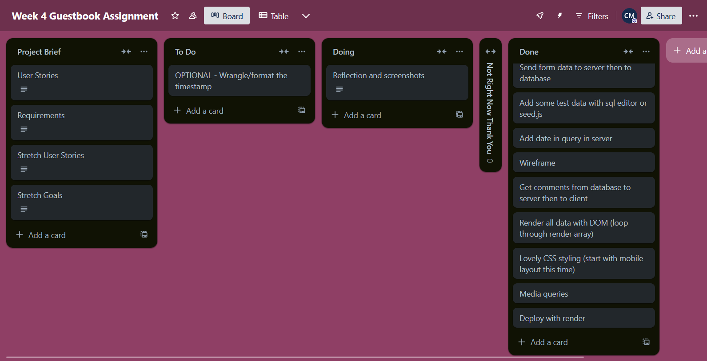

# week4-assignment

**Reflection**
I am pleased with the final result of the project and achieved almost everything I hoped to. I met all the basic requirements with a working HTML form that allows users to select a username and type a comment that will then be displayed (after a refresh) in the guestbook underneath. There are working GET and POST routes to achieve this, and before I got the POST route working I added some dummy data to test the connection between the server and database.

I ran into issues in unexpected areas. The first was with the syntax of my POST request in the server which turned out to be an issue with a missing comma after my SQL query. The second was with the contents of my function in the client to fetch the data from the server's GET request. I realised at that point that I'd never actually sent data from the server to the client before (only the other way around) and was unsure of the exact wording and syntax but got a lot closer than I expected by using the syntax of the fetch requests we'd done in class before, and in the end I turned out to just be missing some brackets.

I was able to pull together different functions and previous bits of code from other assignments and from this week's notes, so everything but the aforementioned sections went pretty smoothly. I ran into a couple of things with my CSS styling that I was unsure about but that was only when trying to achieve the look I was picturing in my head, and I was able to fix it after learning about the textarea tag.

The only thing I was unable to achieve that I had hoped to was in truncating the timestamp so it was formatted nicer and didn't include seconds or milliseconds. I did some googling and asked a friend who knows SQL but I didn't understand any of their solutions. It's something I hope to revisit in the next few weeks once we've done more SQL.

**Sources**
Differences between different timestamp constraints - https://stackoverflow.com/questions/5876218/difference-between-timestamps-with-without-time-zone-in-postgresql
Inserting current timestamp in a query - https://stackoverflow.com/questions/38245025/how-to-insert-current-datetime-in-postgresql-insert-query
Troubleshooting my fetch GET - https://www.freecodecamp.org/news/how-to-make-api-calls-with-fetch/
Styling form inputs - https://www.w3schools.com/css/css_form.asp
Wrapping text inside a text input (turned out I needed textarea) - https://stackoverflow.com/questions/5286663/wrapping-text-inside-input-type-text-element-html-css
Textarea hiding placeholder text - https://stackoverflow.com/questions/10186913/html5-textarea-placeholder-not-appearing

**Screenshots**
Wireframe

Trello

Database schema

